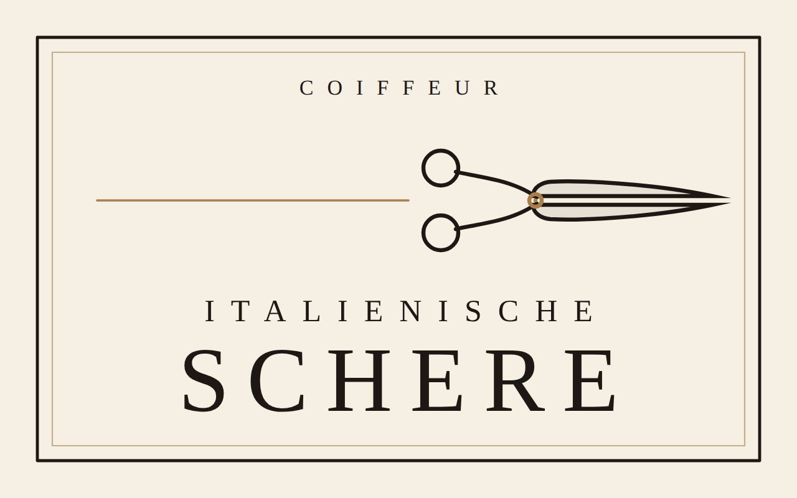

# Barber Italienische Schere

Website des Herrenfriseurs **Barber Italienische Schere** in Bad Reichenhall.
Eine Seite, statisch, ohne Framework und ohne Build-Schritt — einfach die
Dateien auf den Webspace legen.



```
index.html            Startseite (Hero, Preise, Haarschnitte, Massagesessel,
                      Anfahrt, Footer)
impressum.html        Impressum   – Inhaber und Straße fehlen noch
datenschutz.html      Datenschutz – beschreibt den gebauten Stand
daten/preise.json     alle Preise an einer Stelle
daten/galerie.json    Bilder der Sektion „Haarschnitte"
daten/bewertungen.json Note, Anzahl und Zitate der Google-Bewertungen
tools/preise-sync.js  schreibt die Preise aus der JSON ins HTML
assets/css/style.css  gesamtes Aussehen (inkl. Bildausschnitte)
assets/js/main.js     Intro, Slideshow, Live-Status, Galerie, Lightbox, Karte
assets/fonts/         Cormorant Garamond & Inter, selbst ausgeliefert
bilder/               Fotos als JPG (Original) und WebP (ausgeliefert)
logo.svg              Logo, animationsfertig (Dokumentation unten)
animation.html        eigenständige Intro-Animation des Logos
```

## Was noch gefüllt werden muss

Alles Offene steht im Code als `TODO` und ist auf der Seite golden gestrichelt
markiert — man sieht im Browser sofort, was fehlt.

| Was | Wo |
| --- | --- |
| **Straße bestätigen** | „Poststraße 12" stammt vom Preisplakat des Ladens. Steht im Hero-Infoblock, im Abschnitt „Anfahrt", im Impressum, in den strukturierten Daten (`index.html`, `<head>`) und in `assets/js/main.js` → `KARTEN_ADRESSE`. |
| **Öffnungszeiten bestätigen** | dieselben Stellen; die Live-Anzeige rechnet mit `OEFFNUNGSZEITEN` in `assets/js/main.js` |
| **Inhaber fürs Impressum** | `impressum.html` — Name, E-Mail, USt-IdNr., Bildnachweise |
| **Massagesessel-Foto** | `bilder/massagesessel.jpg` — bis dahin steht dort ein markierter Platzhalter |
| **Einverständnis für Fotos** | Auf `intro-4-kunde.jpg` sind zwei Personen klar erkennbar. Vor dem Livegang bitte bestätigen, dass beide mit der Veröffentlichung einverstanden sind. |
| **Bildnachweise** | `impressum.html` — wer die Fotos gemacht hat |
| **Hostinganbieter** | `datenschutz.html`, Abschnitt 3 |
| **Domain** | `index.html`, `canonical` und `og:url` |

Telefonnummer (0176 41874365), Postleitzahl (83435) und der Facebook-Link
sind eingetragen. Instagram gibt es nicht und ist deshalb nirgends verlinkt.

## Preise ändern

Alle Preise stehen in **`daten/preise.json`** — sonst nirgends.

```bash
node tools/preise-sync.js
```

Die Seite liest die JSON beim Aufruf, eine Änderung wirkt also sofort. Damit
aber auch Suchmaschinen und Besucher ohne JavaScript den richtigen Stand sehen,
steht dieselbe Liste zusätzlich im HTML. Der Befehl oben hält beide gleich.

## Bilder

Im Hero laufen vier Bilder als Slideshow, in der Sektion „Haarschnitte" liegen
drei Fotos in Farbe. Alle sind echt. Offen ist nur noch der Massagesessel —
dort steht ein **Platzhalter** (dunkle Kachel, auf der steht, welche Datei
fehlt); beim Ersetzen der Datei verschwindet die Markierung von selbst.

| Datei | Stand |
| --- | --- |
| `bilder/intro-1-innenraum.jpg` | echtes Foto — erstes Bild der Slideshow |
| `bilder/intro-2-fassade.jpg` | echtes Foto |
| `bilder/intro-3-salon.jpg` | echtes Foto |
| `bilder/intro-4-kunde.jpg` | echtes Foto — nur 900 px breit, auf großen Schirmen etwas weich. Falls es das Original größer gibt, lohnt der Austausch. |
| `bilder/haarschnitt-1…3.jpg` | echte Fotos, in Farbe |
| `bilder/massagesessel.jpg` | **Platzhalter** |

**Neues Foto einsetzen** — JPG nach `bilder/` legen (gleicher Dateiname), dann
die ausgelieferten WebP-Fassungen erzeugen:

```bash
node -e "const s=require('sharp');['intro-3-salon','haarschnitt-1'].forEach(n=>[1600,960].forEach(w=>
  s('bilder/'+n+'.jpg').resize({width:w,withoutEnlargement:true}).webp({quality:80})
   .toFile('bilder/'+n+'-'+w+'.webp')))"
```

Ausgeliefert wird immer WebP in zwei Breiten (960 und 1600). Das erste
Hero-Bild wird vorgeladen, die drei übrigen erst, wenn die Seite steht.

**Bildausschnitt:** Die Fotos sind überwiegend Hochformat, der Hero ist quer.
Was im Bild bleibt, steuert `object-position` — pro Motiv eingestellt unter
„Bildausschnitte" in `assets/css/style.css`, getrennt für Desktop und Telefon.
Kommt ein echtes Foto anstelle eines Platzhalters, dort den Wert nachziehen.

**Weitere Haarschnitt-Fotos:** Datei ablegen, WebP erzeugen, in
`daten/galerie.json` einen Eintrag ergänzen (`datei`, `alt` und bei Bedarf
`pos` für den Ausschnitt in der Kachel). Mehr ist nicht nötig — Raster und
Lightbox wachsen mit. Damit auch Suchmaschinen und Besucher ohne JavaScript
die Bilder sehen, stehen dieselben drei Kacheln zusätzlich im HTML; kommen
Fotos dazu, dort einmal nachziehen.

## Bewertungen

Note, Anzahl und Zitate stehen in **`daten/bewertungen.json`**. Ändert sich die
Gesamtnote oder kommt eine Stimme dazu, reicht diese Datei — das Sternenband
rechnet sich daraus (der letzte Stern wird anteilig gefüllt). Dieselbe Fassung
steht zusätzlich im HTML, damit Suchmaschinen und Besucher ohne JavaScript sie
sehen; dort bitte mit ändern.

Drei Dinge sind bewusst so gebaut:

- **Kein `AggregateRating` und kein `Review`** in den strukturierten Daten.
  Bewertungen, die auf einer fremden Plattform liegen, dürfen laut Googles
  Richtlinien nicht als eigenes Markup ausgezeichnet werden.
- **Keine Datumsangaben.** „vor einer Woche" veraltet still vor sich hin.
- **Kein Google-Logo.** Die Quelle wird nur als Text genannt.

Auf dem Telefon werden die Karten zu einem wischbaren Streifen mit Punkten
darunter; ohne JavaScript bleibt der Streifen normal scrollbar, nur die Punkte
entfallen.

## Farben

Die Seite hat zwei Register. **Intro und Hero** stehen dunkel auf den Fotos,
damit das weiße Logo trägt. **Alles darunter** ist hell: weißer Grund,
schwarze Schrift, Gold nur als feine Linie und als Akzent.

Technisch hängt das an einer Stelle: Die hellen Abschnitte (`.prices`,
`.gallery`, `.extra`, `.visit`, `.site-footer`, `.legal-page`, `.lightbox`)
setzen dieselben Variablen auf ihre hellen Werte um — siehe „Heller Teil" in
`assets/css/style.css`. Jede Regel liest einfach `--creme`, `--linie`,
`--gold` und bekommt je nach Umgebung den passenden Wert. Ein neuer heller
Abschnitt braucht also nur seinen Namen in dieser Liste.

Gold als **Text** auf Weiß ist eine dunklere Variante (`--gold-text`,
Kontrast 5,0:1) — das helle Gold käme auf Weiß nur auf 2,8:1. Für Linien und
Rahmen bleibt das helle Gold.

## Wie die Seite sich verhält

- **Intro** — schwarzer Bildschirm, „Italienische Schere – ohne Termin" blendet
  von Grau zu Weiß. Läuft nur beim ersten Aufruf pro Sitzung
  (`sessionStorage`), ist per Klick, Esc oder Leertaste überspringbar und
  entfällt bei `prefers-reduced-motion`.
- **Logo-Auftritt** — die Schere fährt schnippend an ihren Platz, dann zeichnet
  sich der Rahmen und der Schriftzug blendet auf (~1,8 s).
- **Live-Status** — „Jetzt geöffnet · bis 19:00" oder „Geschlossen · öffnet Mo
  09:00", gerechnet aus den Öffnungszeiten in deutscher Ortszeit, also auch für
  Besucher aus anderen Zeitzonen richtig.
- **Bewertungen** — Sternenband aus der Note gerechnet, auf dem Telefon ein
  wischbarer Streifen; der aktive Punkt wandert beim Wischen mit.
- **Lightbox** — Haarschnitt antippen öffnet das Bild groß; Pfeiltasten
  blättern, Esc schließt, der Fokus kehrt zum angetippten Bild zurück. Jede
  Kachel ist ein Link auf das große Foto: ohne JavaScript öffnet der Browser
  einfach das Bild.
- **Karte** — lädt erst nach Klick auf „Karte laden". Vorher geht keine einzige
  Anfrage an Google.
- **Ohne JavaScript** bleibt die Seite vollständig lesbar: kein Intro, keine
  Slideshow-Wechsel, keine Lightbox, keine Karte — aber alle Inhalte stehen im
  HTML.

## Datenschutz

Geprüft am gebauten Stand: **keine** Anfrage an eine fremde Domain, **keine**
Cookies, kein Tracking. Schriften liegen auf dem eigenen Server. Einzige
Ausnahme ist die Karte — und die erst nach ausdrücklichem Klick. Im
`sessionStorage` steht ein einziger Wert (`intro-gesehen`), damit das Intro
nicht bei jedem Seitenwechsel neu läuft.

## Technik

Kein Framework, kein Build. Semantisches HTML, `prefers-reduced-motion` wird
überall beachtet, Tastaturbedienung und sichtbarer Fokus sind durchgängig da.
Geprüft in Chromium auf 375 px, 768 px und 1440 px: keine JS-Fehler, keine
Anfrage an eine fremde Domain, im Hero überlappt nichts. Das erste Hero-Bild
ist vorgeladen, alles andere hängt an `loading="lazy"` beziehungsweise wird
erst nach dem ersten Bildaufbau geholt.

---

# Logo & Intro-Animation


Dieses Repository war leer – es gab kein vorab ausgewähltes Konzept. Deshalb ist hier
**ein** Konzept angelegt und konsequent animationsfertig gebaut: eine feine Linien-Schere,
die auf einer waagerechten Schnittlinie schliesst, darunter der Schriftzug, aussen ein
doppelter Rahmen. Text, Farben und Proportionen lassen sich austauschen, ohne die
Animationslogik anzufassen.

| Datei | Inhalt |
| --- | --- |
| `logo.svg` | Statisches Logo, animationsfreundlich aufgebaut |
| `animation.html` | Hero-Intro (max. 3 s) + dezente Hover-Variante für den Header |
| `preview/logo.png` | Vorschaubild |

---

## 1. Aufbau des SVG

Alles liegt im viewBox-Koordinatensystem `0 0 640 400`.

```
#logo-background                Flaeche (kann entfernt werden)
#logo-frame                     Rahmen
  #frame-outer                  aeussere Linie   – Stroke-Pfad, pathLength="100"
  #frame-inner                  innere Linie     – Stroke-Pfad, pathLength="100"
  #frame-rule                   Schnittlinie     – Stroke-Pfad, pathLength="100"
#logo-wordmark                  Schriftzug
  #wordmark-eyebrow             "COIFFEUR"
  #wordmark-line-1              "ITALIENISCHE"
  #wordmark-line-2              "SCHERE"
#logo-scissors                  Schere
  #blade-bottom                 untere Klinge + oberer Griffring (eine starre Haelfte)
  #blade-top                    obere  Klinge + unterer Griffring (eine starre Haelfte)
  #scissors-screw               Schraube = Drehpunkt
```

### Drehpunkt

Die Schraube liegt auf **430 / 161**. Beide Klingengruppen liegen bewusst *ohne*
transformierte Elterngruppe direkt im viewBox-System, damit der Drehpunkt exakt sitzt:

```css
#blade-top, #blade-bottom{
  transform-box: view-box;
  transform-origin: 430px 161px;   /* Schraube */
}
#blade-top    { transform: rotate(-11deg); }  /* oeffnen  */
#blade-bottom { transform: rotate( 11deg); }
```

Sinnvoller Bereich: `0deg` (geschlossen, auf der Schnittlinie) bis ca. `12deg`.
Der Uebergang von Klinge zu Griff liegt unter der Schraubenscheibe – beim Oeffnen
bleibt die Mechanik dadurch sauber verdeckt.

> **Wichtig beim Wiederverwenden:** `transform-origin` ist immer der Drehpunkt in den
> *eigenen* Nutzerkoordinaten des Elements. Wer einen Ausschnitt mit verschobener
> viewBox nutzt (z. B. nur die Schere), verschiebt die Geometrie besser in ein
> 0-basiertes System – so gemacht bei der kleinen Header-Marke in `animation.html`.
> Die Schere als Ganzes bewegt man über das `<svg>`-Element oder eine Huellgruppe;
> der Drehpunkt der Klingen bleibt davon unberuehrt.

### Nachzeichnen

Rahmen und Schnittlinie sind reine Stroke-Pfade mit `pathLength="100"`:

```css
#frame-outer{ stroke-dasharray:100; stroke-dashoffset:100; }  /* -> 0 zeichnet */
```

Die Klingen sind geschlossene Kontur-Pfade (Stroke + 8 % Flaeche) und lassen sich
ebenso mit `stroke-dasharray` nachzeichnen.

### Farben

Drei Custom Properties, dadurch ist die Invers-Variante ein Einzeiler:

```css
svg{ --ink:#1D1814; --paper:#F6EFE3; --accent:#A97E4B; }   /* hell   */
svg{ --ink:#F2E8D8; --paper:#141110; --accent:#C09A5E; }   /* dunkel */
```

`--paper` ist zugleich die Fuellung der Schraubenscheibe und muss dem Untergrund
entsprechen.

### Schrift

Der Schriftzug ist `<text>` in einem Serifen-Stack (Cormorant Garamond → Didot →
Georgia). **Für die Produktion in Pfade konvertieren**, damit die Marke unabhängig von
installierten Schriften ist. Die Zeile über dem Schriftzug lautet `BARBER`.

---

## 2. Hero-Intro (`animation.html`)

Einfach im Browser oeffnen – die Datei ist eigenstaendig, ohne Build und ohne
Framework. Nur ein optionaler Google-Fonts-Link; faellt er aus, greift der
Serifen-Fallback.

### Ablauf (gesamt 2,8 s)

| ab | Dauer | Was passiert |
| --- | --- | --- |
| 0,06 s | 1,34 s | Die Schere faehrt von links ins Bild und schnippt dabei 4× (Klingen auf/zu). Hinter der Schraube waechst die Schnittspur ueber das cremefarbene Papier. |
| 1,30 s | 0,95 s | Die Haelften gleiten entlang der Schnittlinie auseinander und blenden aus – das Logo wird frei. |
| 1,42 s | 0,98 s | Rahmen und Schnittlinie zeichnen sich nach (`stroke-dashoffset`). |
| 1,50 s | 1,08 s | Die Schere kommt von rechts zurueck und setzt sich an ihre Position im Logo (leichte Restrotation). |
| 1,84 s | 0,82 s | Schriftzug blendet zeilenweise auf. |
| 2,34 s | 0,44 s | Ein letztes, leises Schnippen beim Absetzen. |

Weiche Kurven durchgehend: `easeInOutSine` fuer die Fahrt, `easeOutQuint` fuer das
Absetzen, `easeOutCubic` fuer Papier, Rahmen und Schrift. Ein Schnipp oeffnet ruhig
und schliesst beschleunigt.

Solange die Schere ueber dem Papier liegt, zeichnet sie in Papier-Tinte; mit dem
Freigeben des Logos wechselt sie weich auf die Logo-Farbe.

### Technik

* Reines CSS/JS, keine Bibliothek. Eine kleine rAF-Timeline (`render(t)`) setzt alle
  Werte pro Frame – dadurch laufen Fahrt, Schnippen und Schnittspur garantiert synchron.
* Die Schere liegt als eigene SVG-Ebene deckungsgleich ueber dem Logo und wird als
  HTML-Element bewegt; innerhalb des SVG rotieren nur die Klingen.
* Das Papier ist ein fixes Overlay aus zwei Haelften; die Schnitthoehe (`--cut`) wird
  aus der Position der Klingenebene (viewBox-y = 161) berechnet und bei `resize`
  aktualisiert.

### Verhalten

* **Einmal pro Besuch** – gemerkt in `sessionStorage` (`is-intro`).
* **Ueberspringen** – Button, Klick aufs Papier oder `Esc`; springt nicht hart, sondern
  spult die Timeline in 0,36 s ans Ende.
* **`prefers-reduced-motion: reduce`** – das Logo erscheint sofort statisch, das Papier
  wird gar nicht erst angezeigt, das Hover-Schnippen ist deaktiviert.
* **Ohne JavaScript** – `<noscript>` zeigt das fertige Logo.
* **Hover im Header** – die kleine Marke schnippt einmal kurz (reines CSS, auch bei
  Tastaturfokus).
* Fuer Integration und QA: `window.HeroIntro.play() / .skip() / .finish() / .render(t)`.

Der Hinweis „Hover ueber das Logo“ rechts im Header ist reine Demo-Beschriftung
(`.hint`) und fliegt beim Einbau raus.

### Einbau in eine Seite

1. `#logo-frame` und `#logo-wordmark` als `.logo-art`, `#logo-scissors` als
   `.scissors-art` uebernehmen – beide mit derselben viewBox, deckungsgleich positioniert.
2. Papier-Overlay, Styles und das Script uebernehmen.
3. Farben ueber `--ink` / `--paper` / `--accent` an die Seite anpassen.
